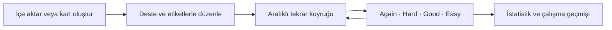
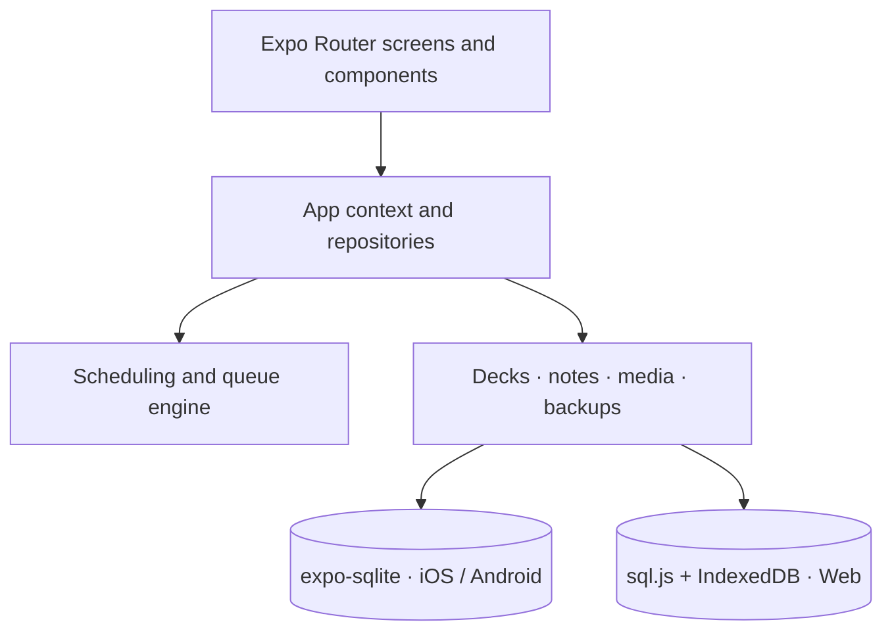

<p align="center">
  
</p>

<h1 align="center">TusAnkiM</h1>

<p align="center">
  Anki-inspired, local-first flashcards for focused medical exam preparation.
</p>

<p align="center">
  <a href="https://github.com/bugraguclu/tus-flashcard-app/actions/workflows/ci.yml"></a>
  
  
  
  <a href="LICENSE"></a>
</p>

<p align="center">
  <a href="#türkçe">Türkçe</a> ·
  <a href="#english-overview">English overview</a> ·
  <a href="https://github.com/bugraguclu/tus-flashcard-app/issues">Support</a> ·
  <a href="docs/privacy.html">Privacy</a>
</p>

---

## Türkçe

**TusAnkiM**, Tıpta Uzmanlık Sınavı (TUS) başta olmak üzere yoğun bilgi gerektiren
sınavlara hazırlanmak için geliştirilmiş, çevrimdışı çalışabilen bir aralıklı tekrar
uygulamasıdır. Anki’den ilham alan çalışma akışlarını modern ve platformlar arası bir
arayüzle iOS, Android ve Web’e taşır.

> [!IMPORTANT]
> TusAnkiM aktif geliştirme aşamasındadır. Bir tıbbi cihaz veya klinik karar aracı değildir;
> kart içeriklerini güvenilir ve güncel kaynaklarla doğrulayın.

### Neden TusAnkiM?

| | Özellik | Ne sağlar? |
|---|---|---|
| 🧠 | **Aralıklı tekrar** | Again, Hard, Good ve Easy yanıtlarıyla kartları doğru zamanda yeniden gösterir. |
| 📦 | **Anki uyumlu iş akışları** | `.apkg`, CSV ve TSV içe aktarma; hiyerarşik ve filtrelenmiş desteler; özel çalışma oturumları. |
| ✍️ | **Zengin kart editörü** | Metin, HTML, görsel, fotoğraf düzenleme, ses kaydı, çizim ve kart şablonları. |
| 📴 | **Yerel ve çevrimdışı** | Kartlar, çalışma geçmişi ve ayarlar varsayılan olarak cihazınızda kalır. |
| 📊 | **Ölçülebilir ilerleme** | Günlük çalışma, doğruluk, süre, seri ve deste/konu bazlı istatistikler. |
| 🌍 | **Tek kod tabanı** | iOS, Android ve Web; Türkçe ve İngilizce arayüz; açık/koyu tema. |

### Başlıca özellikler

- Anki V3 davranışlarından esinlenen planlama motoru, öğrenme/lapse adımları ve gün devri
- Yeni, öğrenilen ve tekrar kartları için deste bazlı limitler ve sıralama seçenekleri
- Leech tespiti, kardeş kart gömme, bayraklar, etiketler ve son yanıtı geri alma
- Hiyerarşik desteler, sürükle-bırak taşıma, filtrelenmiş desteler ve özel çalışma
- Unicode ve aksan duyarlı kart arama; soru, cevap, konu ve ders kapsamı
- Fotoğraf kırpma/döndürme, çizim, ses kaydı, metin okuma ve çalışma beyaz tahtası
- Günlük otomatik yedek, geri yükleme öncesi güvenlik kopyası ve veritabanı bütünlük kontrolü
- Yerel JSON yedeği ile Anki `.apkg`, CSV ve TSV içe aktarma
- Mobil dokunsal geri bildirim ve Web’de klavye kısayolları

### Ekranlar ve çalışma akışı



## English overview

TusAnkiM is an Anki-inspired, local-first spaced-repetition app built for medical exam
preparation. It combines hierarchical and filtered decks, rich card authoring, Anki package
imports, offline storage, backups, and detailed study statistics in one Expo codebase for iOS,
Android, and Web.

The project is independent and is not affiliated with or endorsed by Ankitects or Anki.

## Technology

| Area | Implementation |
|---|---|
| Application | Expo 54 · React Native 0.81 · React 19 |
| Language | TypeScript 5.9 |
| Navigation | Expo Router |
| Native database | `expo-sqlite` with WAL mode |
| Web database | `sql.js` persisted to IndexedDB |
| Card rendering | React Native WebView / DOM on Web |
| Testing | Vitest integration and unit test suite |
| Delivery | GitHub Actions · Expo/EAS-ready configuration |

## Architecture

TusAnkiM separates UI, study orchestration, scheduling, and persistence so the same domain logic
runs on every platform.



Key modules:

- `lib/studyRepository.ts` — queue construction, answers and undo
- `lib/scheduler.ts` — interval and card-state transitions
- `lib/deckManager.ts` — deck hierarchy, options and filtered decks
- `lib/noteManager.ts` — note/card lifecycle and full-text indexing
- `lib/importApkg.ts` — Anki package import and scheduling transfer
- `lib/backup.ts` — automatic snapshots and safe restore
- `lib/db.ts` / `lib/webDb.ts` — platform-specific database adapters

## Getting started

### Requirements

- Node.js 20 or newer
- npm
- Xcode for local iOS builds
- Android Studio and an Android SDK for local Android builds

### Installation

```bash
git clone https://github.com/bugraguclu/tus-flashcard-app.git
cd tus-flashcard-app
npm ci
```

### Development

```bash
# Start Expo and choose a target
npm start

# Run a native development build
npm run ios
npm run android

# Start the web app
npm run web
```

### Quality checks

```bash
# TypeScript + complete test suite
npm run check

# Production web export
npm run build:web

# Expo project diagnostics (via the latest doctor CLI)
npx expo-doctor
```

## Project structure

```text
app/          Expo Router screens and application routes
components/   Shared UI, card, media and study components
contexts/     Application-wide state providers
hooks/        Startup and localization hooks
lib/          Scheduling, data, import/export and domain logic
locales/      Turkish and English native metadata
assets/       Branding, icons and seed data
test/         Shared test harnesses
docs/         Support, privacy and release documentation
```

## Data and privacy

TusAnkiM follows a local-first model. Core study data is stored on the device and is not sent to
an application server by this project. Users remain responsible for exporting backups and for the
content they import. See the [privacy policy](docs/privacy.html) and use the
[issue tracker](https://github.com/bugraguclu/tus-flashcard-app/issues) for support.

## Contributing

Issues and pull requests are welcome. Please read [CONTRIBUTING.md](CONTRIBUTING.md) before
submitting a change. Use the provided issue forms for reproducible bug reports and focused feature
requests.

For security-sensitive reports, follow [SECURITY.md](SECURITY.md) instead of opening a public issue.

## License

Distributed under the [MIT License](LICENSE).

## Acknowledgements

TusAnkiM is inspired by the study model and workflows popularized by
[Anki](https://apps.ankiweb.net/). Anki is a separate project and TusAnkiM is not an official Anki
client.
