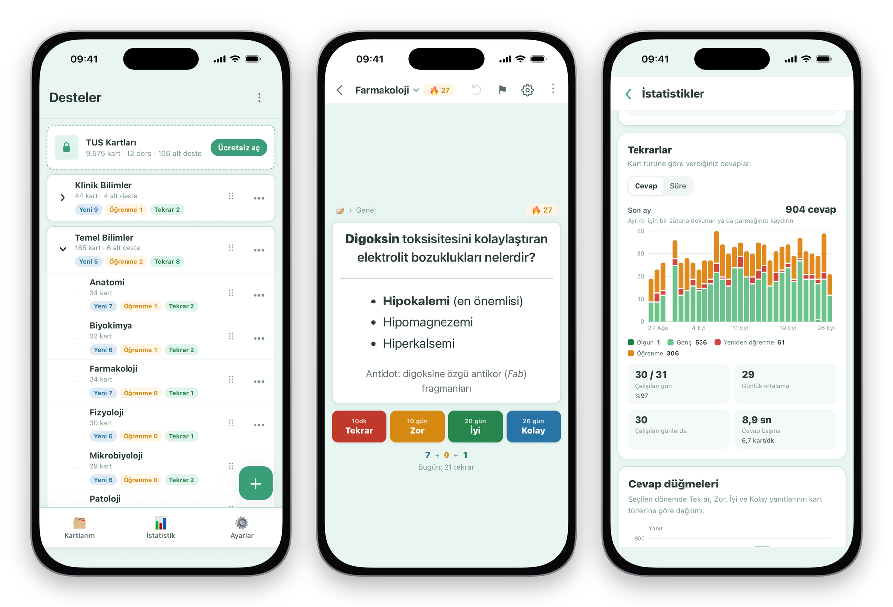
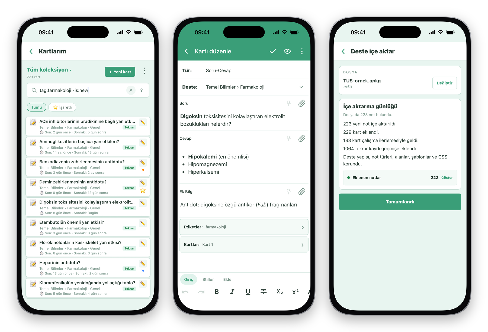

<div align="center">


# TusAnkiM

**Local-first spaced repetition for TUS and medical exam preparation.**

An independent flashcard app for iPhone that works with Anki decks. The same app runs in the browser.

[**Open the live preview →**][preview]

[](https://github.com/bugraguclu/tus-flashcard-app/actions/workflows/ci.yml)
[](https://github.com/bugraguclu/tus-flashcard-app/actions/workflows/codeql.yml)
[](#overview)
[](https://docs.expo.dev/)
[](tsconfig.json)
[](LICENSE)

[Live preview](#live-preview) · [Features](#features) · [Engineering](#engineering-highlights) · [Tech stack](#tech-stack) · [Getting started](#getting-started)

<br>

<picture>
  <source media="(prefers-color-scheme: dark)" srcset=".github/screenshots/decks-study-stats-dark.png">
  
</picture>

<sub>Deck list, study screen and statistics on iPhone. The screenshots use a sample deck.</sub>

</div>

---

## Overview

TusAnkiM is a flashcard app for medical students preparing for TUS (Tıpta Uzmanlık Sınavı,
Turkey's medical specialty exam). It schedules reviews the way Anki does, reads and writes Anki
packages, and keeps the whole collection on the device. There is no account and no server, and it
works fully offline.

An optional TUS card pack (9,575 cards in 12 courses and 106 subdecks) installs for free from
inside the app. It sits next to the learner's own decks and does not change them.

## Live preview

[tusankim.vercel.app][preview] runs the production web build of `master` and is rebuilt on every
push. The iPhone app is the release target, and the browser version is a preview of the same code.
It opens with an empty collection: install the free TUS card pack from the deck list, or drop your
own deck onto the window.

The collection stays in the browser and is never uploaded, and the page's Content-Security-Policy
allows no third-party origins. After the first visit the app starts without a network connection
and can be installed to the home screen or dock. Reminders fire only while a tab is open, and
Shortcuts exist only on iPhone.

## Features

### Study

- Anki's card lifecycle: new, learning, review and relearning cards, with learning steps, lapses,
  leeches, sibling burying, daily limits and learn-ahead
- Anki's classic scheduler or FSRS-6, all thirteen review orders, filtered decks and Custom Study
- Answer undo, Timebox, auto advance, typed answers, text-to-speech and an on-card whiteboard

### Cards

- Note types with conditional templates, cloze deletions, typed-answer and reversed cards
- A rich text editor with formatting, lists, tables, links, callouts and a raw HTML view, plus
  images, audio recording and photo annotation
- A card browser with Anki's search syntax (`deck:`, `tag:`, `is:`, `prop:`, `added:` and more),
  flags, tags, suspend, bury and reposition

<p align="center">
  <picture>
    <source media="(prefers-color-scheme: dark)" srcset=".github/screenshots/browser-editor-import-dark.png">
    
  </picture>
  <br>
  <sub>Card browser with Anki search syntax, the note editor, and the import log of an <code>.apkg</code> package.</sub>
</p>

### Import, export and backups

- `.apkg` and `.colpkg` packages with media and scheduling, and CSV, TSV and TXT files with
  Anki's importer options
- Automatic daily backups, manual backups, a validated restore, and a database check with repair

### Statistics

- Today's summary, daily streak, future due, reviews and review time, answer buttons, intervals,
  card counts and added cards
- A study calendar built from the review log, and per-card info

### On iPhone

- `.apkg`, `.colpkg`, CSV, TSV and TXT files open straight from the Files app
- Per-deck Apple Shortcuts, and `tusankim://` automation with x-callback-url
- Study reminders, VoiceOver labels, Dynamic Type, and light and dark themes
- Turkish and English interface

## Engineering highlights

- The package importer reads both legacy and current zstd-compressed Anki collections, with their
  media, note types, scheduling and review history. Archives are size-bounded, and the SQLite
  database inside is validated before anything reaches the collection. Round-trip tests check that
  note GUIDs, templates, FSRS memory state and the review log survive.
- Two schedulers are implemented in TypeScript: Anki's classic algorithm, and FSRS-6 with memory
  state, rescheduling and parameter optimisation. The FSRS tests compare results with reference
  values from the upstream fsrs-rs project.
- The same versioned migrations run on `expo-sqlite` on iPhone and on sql.js (WebAssembly) in the
  browser. There the database is saved to IndexedDB, and a Web Locks writer lock keeps a second
  tab read-only. Platform differences sit behind `.web.ts` module splits, so every screen imports
  the same module on both platforms.
- Imports and restores run in a single transaction, so a failed one leaves the collection as it
  was. A destructive import or restore asks for confirmation and takes a backup first.
- Card HTML from imported decks is treated as untrusted. Scripts, inline event handlers and
  `javascript:` URLs are stripped from fields and templates, and each card renders in an isolated
  WebView document whose Content-Security-Policy blocks scripts, network access and navigation.
- A local Expo module written in Swift adds per-deck Shortcuts. The collection is encrypted
  at rest with `NSFileProtectionComplete`.

## Tech stack

| Layer | Technology |
| --- | --- |
| App | [Expo](https://expo.dev/) SDK 57, React Native 0.86, React 19, TypeScript (strict) |
| Navigation | Expo Router: file-based routes and a static web export |
| Storage | SQLite through `expo-sqlite` on iOS, and [sql.js](https://sql.js.org/) (WebAssembly) persisted to IndexedDB on the web |
| Packages | JSZip and fzstd for Anki's zip and zstd-compressed collections |
| Rendering | `react-native-webview` for sandboxed card and editor documents, and `react-native-svg` for vector graphics |
| Native modules | Two local Expo modules in Swift: deck shortcuts and screen capture protection |
| Testing | Vitest (1,500+ tests), `tsc`, and a native iOS configuration verifier |
| Delivery | GitHub Actions, CodeQL and Dependabot. Vercel hosts the web preview, and `eas.json` holds the iOS build profiles |

## Architecture

```text
app/          Expo Router screens: decks, study, browser, editor, stats, settings
components/   Screen pieces and shared UI: reviewer, rich text editor, charts, sheets
lib/          Domain logic with co-located tests: scheduling, queues, search, storage
              and migrations, package import/export, backups, statistics, sanitising
hooks/        Screen-level hooks: startup, localisation, route scope, notifications
contexts/     App-wide state provider
constants/    Theme tokens for the light and dark palettes
locales/      Native app name and permission strings in Turkish and English
modules/      Local Expo native modules: deck shortcuts and screen guard
public/       Web app manifest, icons and service worker
scripts/      Release verification, card pack tooling and Expo Go sharing
test/         Test stubs and the sql.js harness
docs/         Compatibility matrix, iOS release checklist, audits and legal pages
```

## Quality and testing

`npm run quality` gates every change. It runs the TypeScript compiler, more than 1,500
deterministic tests, and a verifier for the Anki source registry and the native iOS
configuration: file protection, App Transport Security, document types and the packed card pack.

GitHub Actions runs the gate on pushes to `master` and on every pull request, together with
`npm audit`, npm registry signature verification and a production web build. CodeQL scans
pushes and pull requests to `master` and runs weekly, and Dependabot keeps npm packages and
actions current.

The rules for changing the code are in [`AGENTS.md`](AGENTS.md), written for human contributors
and AI coding agents alike. Scheduling, review logging, import and restore are data-safety
boundaries, so changes to them start with focused tests. Device testing follows the targeted
ladder in the [iOS release checklist](docs/IOS_RELEASE_CHECKLIST.md).

## Getting started

You need Node.js 24 (pinned in [`.nvmrc`](.nvmrc)) and npm. The native app also needs macOS with
Xcode and an iOS Simulator.

```bash
git clone https://github.com/bugraguclu/tus-flashcard-app.git
cd tus-flashcard-app
npm ci
npm run web       # the app in the browser
npm run ios       # the native app on the iOS Simulator
npm run quality   # type check, tests and the iOS configuration check
```

Most screens also run in Expo Go, but Files hand-off and Shortcuts need a
development build.

## Security and privacy

Study data stays on the device. There is no account, analytics or tracking, and the iOS privacy
manifest declares no collected data; see the [privacy policy](docs/privacy.html). Please report
vulnerabilities privately as described in [SECURITY.md](SECURITY.md).

## License

The source code is released under the [MIT License](LICENSE). The in-app card pack is covered by
the app's [terms of use](docs/terms.html).

Compatibility work follows Anki's documented behaviour and file formats. Anki and AnkiDroid are
GPL-family projects, and their code is not copied into this MIT repository.

TusAnkiM is an independent project. It is not affiliated with, or endorsed by, Anki or Ankitects.

[preview]: https://tusankim.vercel.app
